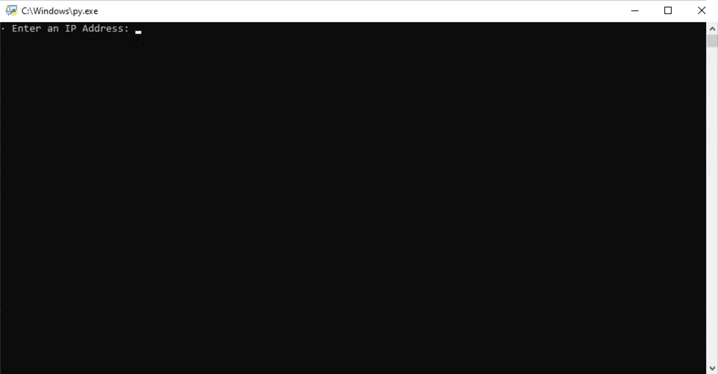

# Red Scanning App
This is an application written in Python that scans networks via nmap.

  

## Getting started
- Get the code:
    ```
    git clone https://github.com/JheyluisReyes/RedScanning.git
    ```

- Open [redscanning.py](redscanning.py) in Visual Studio Code to run the Red Scanning app.

  
